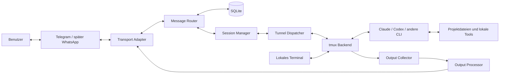
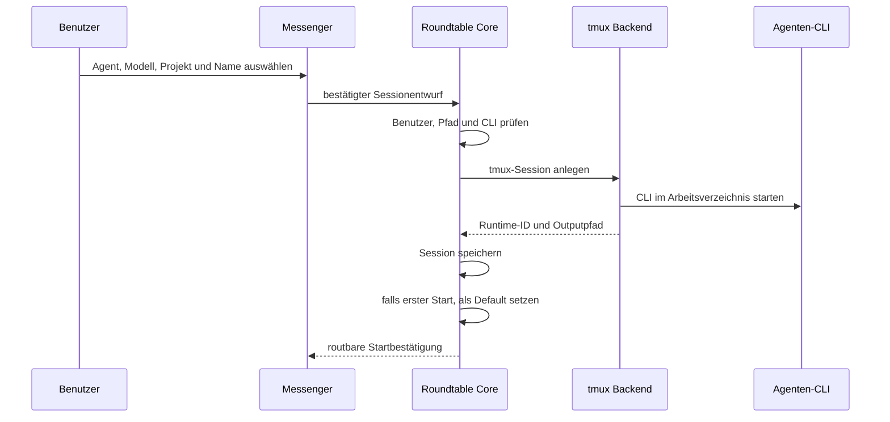
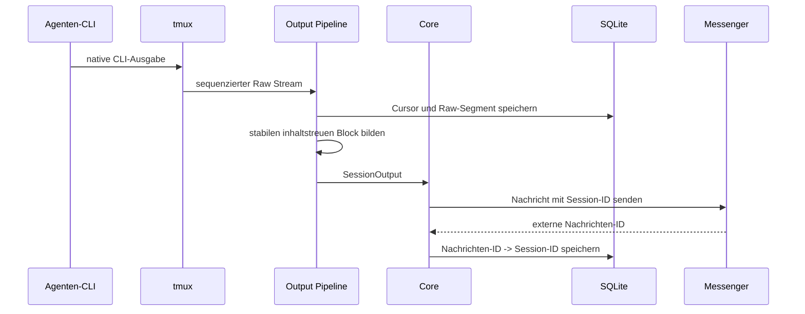
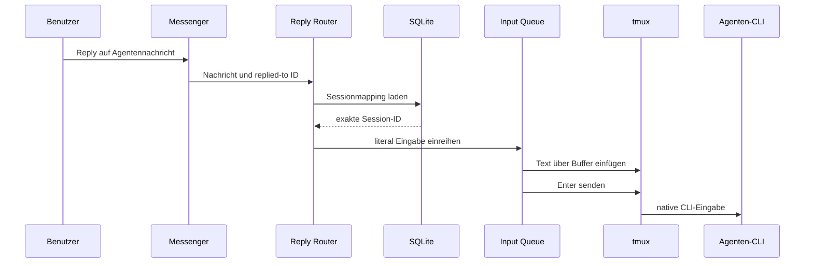

# Technische Architektur

## Architekturthese

Roundtable ist ein Multi-Agent-Chat-Router und ein bidirektionaler Tunnel.

Es führt keinen eigenen Agentendialog und spricht im produktiven
Nachrichtenpfad nicht mit einem separaten Agenten-SDK. Jeder Agent läuft als
echte interaktive CLI in einer dauerhaften Session. Roundtable liest die
Ausgabe dieser Session und schreibt Messenger-Eingaben in dieselbe Session
zurück.

```text
Messenger-Chat
    <-> Roundtable Router
    <-> Session Tunnel
    <-> tmux
    <-> Claude Code / Codex / andere CLI
```

Wer die tmux-Session lokal öffnet, sieht und bedient dieselbe native
Konversation. Roundtable besitzt keinen zweiten Gesprächskontext.

## Architekturziele

- ein gemeinsamer Messenger-Chat für mehrere parallele Agenten,
- Agent und Modell pro Session,
- Replies sicher zur Ursprungssession routen,
- freie Nachrichten zur definierten Default-Session routen,
- erste erstellte Session automatisch als initialen Default setzen,
- jede Eingabe in der echten CLI sichtbar machen,
- jede Agentenantwort aus der echten CLI-Ausgabe beziehen,
- lokales tmux-Attach ohne Kontextwechsel,
- Roundtable-Neustarts ohne Ende laufender tmux-Sessions,
- Telegram zuerst und weitere Messenger später,
- Linux, macOS und Windows via WSL; natives Windows später,
- keine Abhängigkeit von instabilen Agenten-APIs,
- restriktive Benutzer-, Projekt- und Pfadgrenzen.

## Systemübersicht



Der lokale Terminalzugriff und Roundtable treffen sich in derselben
tmux-Session. Es gibt keinen separaten „Telegram-Agenten“.

## Verbindliche Invarianten

1. Jede laufende Roundtable-Session verweist auf genau eine schreibbare native
   CLI-Session.
2. Jede Messenger-Eingabe wird in diese CLI-Session geschrieben.
3. Jede Agentennachricht im Messenger stammt aus der Ausgabe dieser
   CLI-Session.
4. Ein lokales tmux-Attach zeigt denselben Agentenprozess und Verlauf.
5. Roundtable speichert Kopien für Routing und Audit, ist aber nicht
   Gesprächsquelle des Agenten.
6. Hooks oder strukturierte Agentenereignisse dürfen nur Hinweise liefern.
7. Kein Hook, SDK oder API-Pfad darf eine Messenger-Nachricht an der nativen
   CLI-Session vorbeiführen.
8. Reply-Routing hat immer Vorrang vor Default-Routing.
9. Ohne eindeutige Zielsession wird nichts geraten.
10. Spätere Backends müssen dieselbe sichtbare Tunnel-Semantik erfüllen.

## Prozessmodell

### Roundtable Core

Der Core verwaltet:

- Transportverbindungen,
- Benutzer und Pairing,
- Projekte und Allowlist,
- Session Registry,
- Reply-Mappings,
- Default-Session,
- Eingabe-Queues,
- Output-Cursor,
- Abonnements,
- Interaktionen und Buttons,
- Audit und Outbox.

Der Core kann neu gestartet werden, ohne verwaltete tmux-Sessions zu beenden.

### Native Session

Pro Roundtable-Session existiert im ersten Backend:

- eine tmux-Session oder ein eindeutig zugeordnetes tmux-Fenster,
- genau ein primärer Agentenprozess,
- ein freigegebenes Arbeitsverzeichnis,
- eine konfigurierte History,
- ein fortlaufender Raw-Outputpfad,
- ein aktueller Bildschirmzustand,
- ein serialisierter Roundtable-Eingabepfad.

Die CLI verwendet ihre bereits vorhandene lokale Authentifizierung,
Konfiguration, MCP-Server, Plugins, Skills und Berechtigungen.

### Lokaler Zugriff

Der Benutzer kann sich jederzeit lokal verbinden:

```text
tmux attach-session -t <roundtable-runtime-id>
```

Danach kann er direkt schreiben. Roundtable beobachtet weiterhin dieselbe
Ausgabe. Lokale und über Messenger gesendete Eingaben verändern denselben
Agentenkontext.

## Hauptkomponenten

### Transport Adapter

Ein Transport Adapter verbindet einen Messenger mit dem Core.

Verantwortung:

- Updates empfangen,
- externe Benutzer- und Chatidentitäten normalisieren,
- Reply-Metadaten liefern,
- Text, Dateien und Buttons senden,
- externe Nachrichten-IDs zurückgeben,
- Transportlimits und Rate Limits behandeln,
- Callback-Aktionen idempotent zustellen.

```text
TransportAdapter
  start(context)
  stop()
  sendMessage(outboundMessage) -> DeliveryReceipt
  editMessage(messageRef, content) -> DeliveryReceipt
  sendFile(outboundFile) -> DeliveryReceipt
  answerInteraction(interactionRef, result)
  capabilities() -> TransportCapabilities
```

Der Adapter bestimmt keine Zielsession. Telegram ist die erste
Implementierung; WhatsApp und weitere Messenger folgen später.

### Message Router

Der Router bestimmt für jede Benutzernachricht genau eine Session:

```text
resolveTarget(message):
  if message is a reply:
      return session mapped to replied message

  if message has an explicit session alias:
      return resolved session

  if a valid default session exists:
      return default session

  return NeedsExplicitSelection
```

Beim ersten erfolgreichen Sessionstart eines Benutzer-/Transportkontexts:

```text
if no default session exists:
    set newly created session as default
```

Spätere Sessionstarts ändern den Default nicht.

### Session Manager

Der Session Manager:

- validiert Projekt, Pfad, Agent und Modell,
- prüft tmux und die lokale Agenten-CLI,
- baut den Startbefehl strukturiert,
- legt die tmux-Session an,
- startet die CLI im Arbeitsverzeichnis,
- aktiviert Output Capture,
- wartet auf erkennbare Startbereitschaft,
- sendet optional die erste Aufgabe,
- registriert Runtime-ID und Output-Cursor,
- verbindet nach einem Core-Neustart erneut,
- stoppt oder archiviert Sessions kontrolliert.

### Agent Definition

Eine Agent Definition ist bewusst dünn. Sie beschreibt nicht einen zweiten
Agenten-Client, sondern wie die vorhandene CLI im Tunnel betrieben wird.

```text
AgentDefinition
  type()
  displayName()
  detectExecutable()
  detectVersion()
  detectAuthentication()
  supportedModelOptions()
  validateSessionSpec()
  buildLaunchCommand()
  buildResumeCommand()
  readinessHints()
  outputHints()
  knownKeyInteractions()
  nativeCommands()
```

Agentenspezifische Hooks dürfen optionale Hinweise liefern:

- Session gestartet,
- Turn abgeschlossen,
- Eingabe erwartet,
- Approval sichtbar,
- Agent beendet.

Diese Hinweise verbessern Zeitpunkt und Status. Der Inhalt wird weiterhin aus
tmux gelesen und jede Antwort weiterhin in tmux geschrieben.

### Session Backend

Das Session Backend kapselt den dauerhaften CLI-Host:

```text
SessionBackend
  checkAvailability()
  create(sessionSpec, launchCommand) -> SessionHandle
  discover(filter) -> SessionHandle[]
  attachInfo(sessionId) -> AttachInfo
  writeLiteral(sessionId, text)
  sendKeys(sessionId, keys)
  captureScreen(sessionId) -> ScreenSnapshot
  streamOutput(sessionId, cursor) -> OutputChunk[]
  inspect(sessionId) -> BackendStatus
  interrupt(sessionId)
  resize(sessionId, columns, rows)
  stop(sessionId, stopMode)
```

Das erste Backend ist tmux. Ein späteres ConPTY-Backend muss denselben
Verhaltensvertrag erfüllen.

### Tunnel Dispatcher

Der Tunnel Dispatcher ist der einzige schreibende Roundtable-Pfad zur CLI.

Er:

- nimmt einen bereits autorisierten SessionInput entgegen,
- prüft die aktuelle Runtime-Generation,
- serialisiert Eingaben pro Session,
- schreibt Text literal,
- sendet die gewünschte Abschlusstaste,
- protokolliert den technischen Zustellstatus,
- führt niemals Shell-Interpolation mit Messengertext aus.

### Output Collector

Der Output Collector besitzt zwei Datenquellen:

#### Fortlaufender Stream

`tmux pipe-pane` oder ein äquivalenter Backendstrom liefert alle
Terminalbytes in Reihenfolge. Er ist Grundlage für Raw Log, Output-Cursor und
verlustarme Wiederaufnahme.

#### Bildschirm-Snapshot

`tmux capture-pane` liefert den aktuellen gerenderten Zustand. Er hilft bei:

- Vollbild-TUIs,
- überschriebenen Zeilen,
- Approvals,
- Diagnose,
- Wiederverbindung,
- Erkennung veralteter Buttons.

Stream und Snapshot dürfen nicht miteinander verwechselt werden.

### Output Processor

Der Processor erzeugt aus dem Raw Stream stabile Messengerblöcke:

1. Zeichenkodierung dekodieren,
2. ANSI- und Cursorsteuerung interpretieren,
3. Spinner und überschreibende Zeilen stabilisieren,
4. neue stabile CLI-Ausgabe gegenüber dem letzten Cursor bestimmen,
5. bekannte Turn- oder Prompt-Hinweise berücksichtigen,
6. Secrets nach Best-Effort-Regeln maskieren,
7. transportgerecht teilen und rendern,
8. Abonnement anwenden.

Roundtable verwendet dafür kein Sprachmodell. Es fasst Inhalte nicht
eigenmächtig zusammen.

### Input Queue

Jede Session besitzt eine serielle Roundtable-Queue:

```text
SessionInput
  id
  sessionId
  sourceTransportMessageId
  text or keys
  appendEnter
  idempotencyKey
  sequence
  status
```

Lokale Tastatureingaben in einer attachten tmux-Session laufen außerhalb
dieser Queue. Deshalb werden stale Approvals vor einer Button-Aktion erneut
gegen den aktuellen Bildschirm geprüft.

### Interaction Manager

Approvals und Auswahlfragen bleiben Tunnelinteraktionen.

Der Interaction Manager:

- speichert den unveränderten sichtbaren Prompt,
- ordnet ihn der Session und Runtime-Generation zu,
- bietet Buttons nur bei bekannter Tastenwirkung an,
- prüft vor dem Senden den aktuellen CLI-Zustand,
- sendet Text oder Tasten über den Tunnel Dispatcher,
- verhindert doppelte Antworten.

Roundtable entscheidet die Freigabe nicht selbst.

### Notification Manager

Der Notification Manager:

- bildet die gemeinsame Inbox aus Ausgaben vieler Sessions,
- wendet Benachrichtigungsmodi an,
- führt kurze Outputstücke zusammen,
- aktualisiert flüchtige Fortschrittsnachrichten,
- begrenzt Ausgaben pro Chat,
- behandelt Telegram-Backpressure,
- sendet große Inhalte als Datei,
- speichert jede externe Nachrichten-ID mit Session-ID.

## Sicheres Schreiben in tmux

Messengertext darf nicht Teil eines evaluierten Shellstrings werden.

Vorgesehener Ablauf:

1. Text als Daten in einen tmux-Buffer laden.
2. Buffer literal in das Ziel-Pane einfügen.
3. Optional Enter als separate Taste senden.
4. Zustellung und Runtime-ID protokollieren.

Mehrzeilige Texte, Backticks, Dollarzeichen und Shell-Metazeichen bleiben
Inhalt und werden nicht durch Roundtable interpretiert.

## Datenfluss: Sessionstart



## Datenfluss: CLI-Ausgabe in den Chat



## Datenfluss: Reply in dieselbe CLI



Die Default-Session wird in diesem Ablauf nicht betrachtet, weil eine Reply
bereits ein eindeutiges Ziel besitzt.

## Datenfluss: Freie Nachricht

```text
Nachricht ohne Reply
  -> expliziten Sessionalias prüfen
  -> sonst Default-Session laden
  -> Eingabe in deren tmux-Session schreiben
  -> fehlt ein gültiger Default: Sessionauswahl zeigen
```

## Persistenz

SQLite speichert:

- Benutzer und Transportidentitäten,
- Projekte,
- logische Sessions,
- tmux-Runtime-IDs,
- Default-Zuweisungen,
- externe Message-ID-zu-Session-ID-Mappings,
- Input-Queue und Idempotenz,
- Output-Cursor,
- Interaktionen,
- Abonnements,
- Audit und Outbox.

SQLite speichert nicht den maßgeblichen Agentenkontext. Dieser lebt in der
nativen CLI und deren eigener Sessionpersistenz. Roundtable-Verläufe sind
Routing-, Anzeige- und Auditkopien.

Große Raw Logs liegen in lokalen append-only Dateien. SQLite referenziert
Pfade, Offsets und Prüfsummen.

## Transactional Outbox

Zu sendende Messengerereignisse werden mit ihrem Zustand in SQLite
persistiert. Ein Worker stellt sie mit Retry und Backoff zu.

Die Outbox verhindert:

- still verlorene Agentenausgaben bei Transportausfall,
- nicht routbare Nachrichten ohne gespeicherte Sessionzuordnung,
- doppelte Buttonaktionen,
- unkontrollierten Outputstau.

## Hooks und strukturierte Ereignisse

Hooks sind optional und nicht vertrauensbestimmend.

Erlaubte Nutzung:

- Collector sofort aufwecken,
- Turn-Ende markieren,
- Status aktualisieren,
- bekannten Approval-Prompt schneller finden,
- Sessionende erkennen.

Nicht erlaubte Nutzung:

- Messengertext direkt in einen separaten Agentenkanal senden,
- Antworten außerhalb der nativen CLI empfangen,
- einen zweiten Gesprächsverlauf führen,
- Freigaben automatisch entscheiden,
- tmux-Ausgabe als Quelle vollständig ersetzen.

Fehlt ein Hook oder ändert sich seine Version, funktioniert der Tunnel mit
Outputbeobachtung weiter, möglicherweise mit weniger präzisem Status.

## Neustart und Wiederverbindung

Nach einem Core-Neustart:

1. SQLite und unvollständige Outboxeinträge öffnen.
2. als laufend gespeicherte Sessions laden.
3. tmux nach den gespeicherten Runtime-IDs fragen.
4. Arbeitsverzeichnis und primären Prozess validieren.
5. Output Capture und Cursor wiederverbinden.
6. Backlog seit dem letzten bestätigten Cursor verarbeiten.
7. fehlende Sessions als `disconnected` markieren.
8. niemals allein aufgrund eines ähnlichen Namens eine fremde Session
   übernehmen.

## Plattformen

### Linux

Roundtable und tmux laufen direkt. Der Core wird als `systemd --user` Dienst
installiert.

### macOS

Roundtable läuft als `launchd` User Agent. Der Installer prüft oder installiert
tmux. Agenten-CLI und tmux laufen im selben Benutzerkontext.

### Windows mit WSL

Der erste Windows-Weg betreibt Roundtable, tmux und Agenten-CLIs gemeinsam in
WSL. Pfade und Authentifizierung müssen innerhalb von WSL verfügbar sein.

### Windows nativ, später

Ein ConPTY Session Host kann tmux ersetzen. Er muss:

- eine echte dauerhafte CLI halten,
- literal Text und Tasten empfangen,
- Raw Output und Screen State liefern,
- einen lokalen Attach-Client anbieten,
- bei Core-Neustart weiterlaufen,
- denselben sichtbaren Agentenverlauf bewahren.

Er ist ein alternatives Session Backend, keine andere Produktarchitektur.

## Technologieempfehlung

Go bleibt eine geeignete Ausgangsbasis für Core und Distribution:

- einzelnes Binary,
- gute Dienstintegration,
- einfache parallele Tunnel und Queues,
- SQLite-Unterstützung,
- Cross-Compilation.

Die erste Implementierung kann tmux über kontrollierte Subprozesse ansprechen.
Für natives Windows muss eine echte ConPTY-Lösung separat evaluiert werden;
Unix-PTY-Bibliotheken reichen dafür nicht.

## Nichtfunktionale Leitlinien

- Routingkorrektheit hat Vorrang vor Latenz.
- Ein Reply darf nie an die Default-Session fallen.
- Eingaben derselben Session bleiben geordnet.
- Messenger-Ausfall stoppt Agenten nicht.
- Core-Ausfall stoppt tmux-Sessions nicht.
- tmux-Ausfall ist ein sichtbarer Sessionfehler.
- Transportupdates und Buttons sind idempotent.
- Output-Backpressure blockiert nicht die CLI.
- Persistenzfehler blockieren neue riskante Zustellungen.
- Agenten-CLIs bleiben unabhängig aktualisierbar.
- Die Funktion „lokal attachen und denselben Verlauf sehen“ ist ein
  verpflichtender End-to-End-Test.
