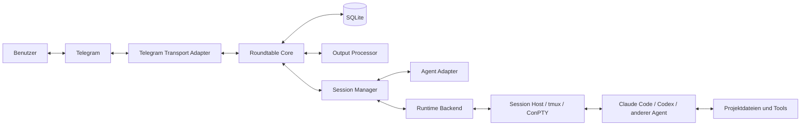
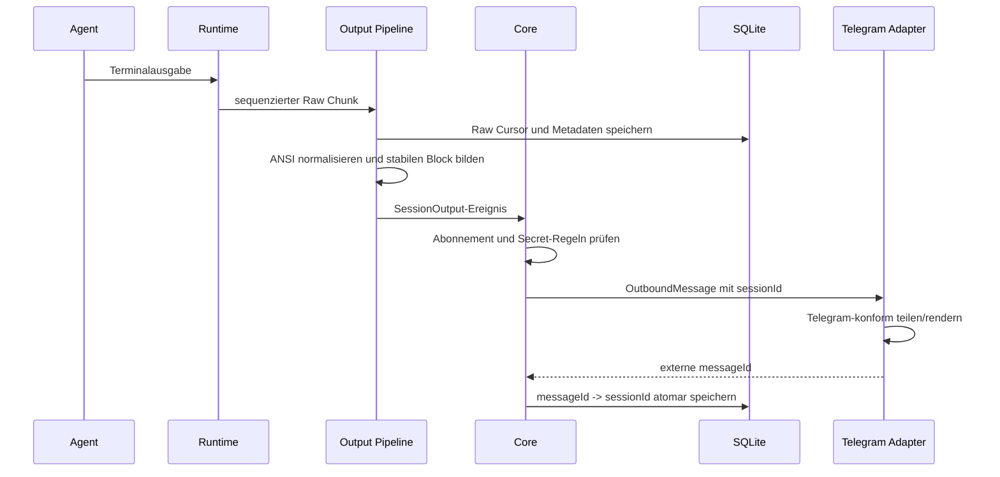
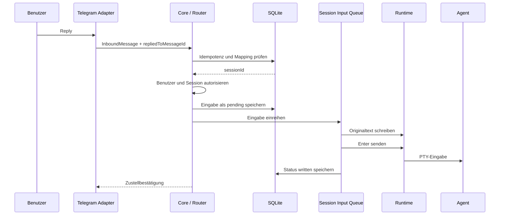
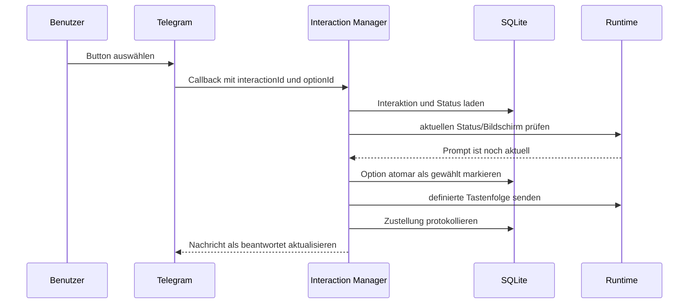

# Technische Architektur

## Architekturziele

Die Architektur muss gleichzeitig folgende Anforderungen erfüllen:

- mehrere Agenten und mehrere Sessions parallel,
- eindeutiges Reply-Routing,
- Telegram zuerst, weitere Kanäle später,
- Linux, macOS und Windows,
- lokaler Rechner oder VPS,
- dauerhafte interaktive Terminal-Sessions,
- Neustart des Routers ohne unnötigen Verlust laufender Sessions,
- inhaltstreue Nachrichtenübertragung,
- sichere Projekt- und Benutzergrenzen,
- einfache Installation und Aktualisierung.

## Systemübersicht



## Prozessmodell

Roundtable besteht logisch aus zwei Lebenszyklen:

### Control Plane

Der Roundtable-Daemon verwaltet:

- Telegram-Verbindung,
- Benutzer- und Projektkonfiguration,
- Session Registry,
- Routing,
- Menüs und Callback-Aktionen,
- Status und Benachrichtigungen,
- Persistenz und Audit,
- Wiederverbindung zu Session Hosts.

### Session Plane

Jede laufende Agent-Session besitzt einen Runtime-Kontext, der:

- ein Pseudoterminal hält,
- den Agentenprozess startet,
- Eingaben serialisiert,
- Roh-Ausgabe erfasst,
- den aktuellen Terminalbildschirm bereitstellt,
- Prozessstatus und Exit-Code meldet,
- möglichst unabhängig von einem kurzfristigen Router-Neustart bleibt.

Unter Linux und macOS kann tmux diese Rolle zunächst übernehmen. Für native
Windows-Unterstützung wird ein eigener Session Host auf Basis von ConPTY
benötigt. Die Core-Schnittstelle ist für beide identisch.

## Hauptkomponenten

### Roundtable Core

Enthält die transport-, agenten- und plattformunabhängige Geschäftslogik:

- Zielsession bestimmen,
- Zugriffe autorisieren,
- Sessionzustände verwalten,
- eingehende Nachrichten idempotent verarbeiten,
- Eingaben zur Runtime einplanen,
- Ausgaben als Domänenereignisse klassifizieren,
- Benachrichtigungsregeln anwenden,
- Auditdaten erzeugen.

Der Core kennt Telegram nicht direkt. Er arbeitet mit internen IDs und
normalisierten Nachrichtenobjekten.

### Transport Adapter

Übersetzt zwischen einem externen Messaging-System und dem Core.

Verantwortung:

- Updates empfangen,
- Benutzer- und Chatidentität normalisieren,
- Reply-Metadaten liefern,
- Text, Dateien und Buttons senden,
- externe Nachrichten-IDs zurückgeben,
- Callback-Aktionen idempotent zustellen,
- Transportlimits beachten,
- Fehlversuche und Rate Limits melden.

Nicht verantwortlich:

- Sessionziel selbst bestimmen,
- Agentenprompt interpretieren,
- Freigaben entscheiden,
- Projektzugriff festlegen.

Vorgesehener Vertrag:

```text
TransportAdapter
  start(context)
  stop()
  sendMessage(outboundMessage) -> DeliveryReceipt
  editMessage(messageRef, content) -> DeliveryReceipt
  sendFile(outboundFile) -> DeliveryReceipt
  answerInteraction(interactionRef, result)
  capabilities() -> TransportCapabilities
```

### Message Router

Der Message Router bestimmt für jede Benutzereingabe genau eine Zielsession.

```text
resolveTarget(inboundMessage):
  if inboundMessage.replyReference exists:
      return mapping(replyReference)

  if inboundMessage.explicitSessionTarget exists:
      return resolveAlias(explicitSessionTarget)

  if defaultSession(user, transportContext) exists:
      return defaultSession

  return NeedsExplicitSelection
```

Vor der Zustellung werden Zugriff, Status und Idempotenz geprüft. Eine
fehlgeschlagene Auflösung darf nie auf eine zufällige oder zuletzt aktive
Session zurückfallen.

### Session Manager

Verantwortlich für den vollständigen Session-Lebenszyklus:

- Sessionentwurf validieren,
- Arbeitsverzeichnis oder Worktree vorbereiten,
- Agent-Startbefehl über Adapter erzeugen,
- Runtime erstellen,
- Startbereitschaft erkennen,
- initiale Aufgabe senden,
- Status aktualisieren,
- Runtime nach Neustart wiederfinden,
- Session stoppen, archivieren oder wiederaufnehmen.

### Agent Adapter

Kapselt agentenspezifisches Wissen:

- Installation und Version erkennen,
- unterstützte Modelle und Optionen beschreiben,
- sicheren Startbefehl aufbauen,
- Resume-Mechanismus verwenden,
- Bereitschaft und bekannte Interaktionen erkennen,
- Approval-Optionen auf konkrete Tasten abbilden,
- agentenspezifische Kommandos anbieten,
- Agentenstatus in den kanonischen Sessionstatus übersetzen.

Ein Adapter besitzt keinen globalen Zustand. Seine Konfiguration wird pro
Session instanziiert.

### Runtime Backend

Kapselt die Betriebssystem- und Terminaldetails:

```text
RuntimeBackend
  checkAvailability()
  create(runtimeSpec) -> RuntimeHandle
  discover(discoveryFilter) -> RuntimeHandle[]
  attach(runtimeId)
  writeText(runtimeId, text)
  sendKeys(runtimeId, keys)
  captureScreen(runtimeId) -> ScreenSnapshot
  streamOutput(runtimeId, cursor) -> OutputChunk[]
  interrupt(runtimeId)
  resize(runtimeId, columns, rows)
  inspect(runtimeId) -> RuntimeStatus
  stop(runtimeId, stopMode)
```

Der Runtime-Handle ist nicht mit der Roundtable-Session-ID identisch. Diese
Trennung erlaubt Runtime-Wechsel, Wiederaufnahme und Import.

### Output Collector

Liest Roh-Ausgabe inkrementell und erzeugt sequenzierte Chunks:

```text
RawOutputChunk
  sessionId
  runtimeId
  sequence
  bytes
  capturedAt
  streamKind
```

Der Collector darf keine Chunks doppelt publizieren. Ein persistierter Cursor
ermöglicht Wiederaufnahme nach einem Router-Neustart.

### Output Processor

Erzeugt aus Rohdaten transportierbare Inhalte:

1. Decoder für Zeichenkodierung,
2. ANSI-/Terminalparser,
3. Stabilisierung überschreibender Zeilen,
4. Erkennung bekannter Agentenereignisse,
5. Bildung stabiler Nachrichtenblöcke,
6. Secret-Filter,
7. transportabhängiges Rendering,
8. Benachrichtigungsfilter.

Wichtig: Der Raw Output bleibt unverändert. Verarbeitete Darstellungen werden
als abgeleitete Daten gespeichert.

### Interaction Manager

Verwaltet Rückfragen und Freigaben:

- erzeugt eine eindeutige Interaction-ID,
- speichert Prompt und erwarteten Runtime-Zustand,
- stellt Optionen mit konkreter Terminalwirkung bereit,
- verhindert doppelte Antworten,
- prüft Ablauf und Aktualität,
- übergibt die gewählte Eingabe an die Session Queue.

### Input Queue

Jede Session besitzt eine serielle Eingabe-Queue. Ein Queue-Eintrag enthält:

- interne ID,
- Session-ID,
- Quelle und Benutzer,
- Originaltext oder Tastenfolge,
- optionale Interaction-ID,
- Idempotenzschlüssel,
- Erstellungszeit,
- Zustellstatus,
- Fehlermeldung.

Die Queue bestätigt „an Runtime geschrieben“, nicht „vom Agenten verstanden“.

### Notification Manager

Entscheidet anhand von Abonnement und Ereignistyp, ob eine Sessionausgabe in
einen Transport gesendet wird. Er verwaltet außerdem:

- Zusammenführungsfenster,
- Fortschrittsnachrichten,
- Wiederholungsversuche,
- Aufteilung großer Inhalte,
- Zuordnung aller gesendeten Nachrichten zur Session.

### Persistence

SQLite ist für den lokalen Einzelknotenbetrieb vorgesehen. Gründe:

- keine externe Datenbank erforderlich,
- transaktionale Routingzuordnungen,
- zuverlässige Idempotenz,
- einfache Sicherung,
- auf allen Zielplattformen verfügbar.

Dateibasierte Roh-Logs können ergänzend außerhalb der Datenbank gespeichert
werden. Pfade und Prüfsummen werden in SQLite referenziert.

## Datenfluss: Agentenausgabe nach Telegram



Die Nachricht gilt erst als routbar, nachdem ihre externe ID gespeichert wurde.
Scheitert diese Persistenz, muss die Zustellung wiederholt oder sichtbar als
nicht routbar markiert werden.

## Datenfluss: Telegram-Reply zum Agenten



## Datenfluss: Freigabebutton



## Ereignismodell

Interne Ereignisse entkoppeln Runtime, Core und Transport. Beispiele:

- `SessionCreated`
- `SessionStartRequested`
- `SessionStarted`
- `SessionReady`
- `SessionStatusChanged`
- `RawOutputCaptured`
- `StableOutputProduced`
- `QuestionDetected`
- `ApprovalDetected`
- `SessionInputQueued`
- `SessionInputWritten`
- `SessionInputFailed`
- `TransportMessageDelivered`
- `TransportDeliveryFailed`
- `RuntimeDisconnected`
- `AgentExited`
- `SessionStopped`

Für die erste Implementierung genügt ein transaktionaler lokaler Event
Dispatcher mit Outbox-Tabelle. Ein verteilter Message Broker ist nicht nötig.

## Transactional Outbox

Zustandsänderung und zu sendendes Ereignis werden in derselben
SQLite-Transaktion gespeichert. Ein Worker verarbeitet die Outbox und markiert
erfolgreiche Zustellungen.

Dies verhindert insbesondere:

- verlorene Telegram-Nachrichten nach einem Prozessabsturz,
- gespeicherte Zustellung ohne tatsächlichen Queue-Eintrag,
- doppelte Freigabeaktionen,
- nicht nachvollziehbare Statuswechsel.

## Konfiguration

Konfiguration wird in drei Klassen getrennt:

### Statische Konfiguration

- Datenverzeichnis,
- Log-Level,
- aktivierte Adapter,
- Runtime-Prioritäten,
- Bind-Adressen lokaler APIs.

### Secrets

- Telegram-Bot-Token,
- spätere Transport-Credentials,
- Referenzen auf Agenten-API-Schlüssel.

Secrets gehören in Betriebssystem-Keychains, Secret Stores oder restriktiv
geschützte Dateien. Sie dürfen nicht als normale Projektdaten in SQLite oder
Logs erscheinen.

### Dynamische Konfiguration

- Benutzer,
- Projekte,
- Sessions,
- Defaults,
- Abonnements,
- Berechtigungsprofile.

Sie wird transaktional in SQLite verwaltet.

## Lokale API

Eine lokale, authentifizierte API kann CLI, spätere Weboberfläche und
Session-Hosts verbinden. Sie sollte nicht standardmäßig öffentlich lauschen.

Mögliche Schnittstellen:

- Unix Domain Socket unter Linux/macOS,
- Named Pipe unter Windows,
- Loopback-HTTP mit lokalem Token als portabler Fallback.

Öffentliche Remote-Zugriffe sollen später über explizites Pairing, TLS und
Node-Identitäten erfolgen.

## Deployment-Modelle

### Lokaler Einzelrechner

Roundtable, Runtime und Agenten laufen auf demselben Rechner. Telegram ist der
einzige externe Dienst.

### VPS

Roundtable läuft als Benutzer-Dienst auf einem VPS. Projekte und Agenten liegen
auf demselben Server. Der Bot darf nur freigegebene Telegram-Benutzer bedienen.

### Windows mit WSL

Roundtable kann entweder vollständig in WSL mit tmux laufen oder nativ mit
einem Windows-Transport/Core und WSL-Runtime-Adapter. Die erste unterstützte
Variante muss klar im Installer benannt werden.

### Mehrere Nodes, später

Ein Benutzer kann mehrere Rechner mit einem Control Plane verbinden. Jede
Session gehört dann zusätzlich zu einem Node. Reply-Routing bleibt
sessionbasiert; der Node wird aus der Session aufgelöst.

## Technologieempfehlung

Für ein installierbares Einzelbinary ist Go eine pragmatische Ausgangsbasis:

- gute Unterstützung für Dienste und Netzwerkprozesse,
- einfache Cross-Compilation,
- eingebettete SQLite-Nutzung,
- überschaubare Distribution,
- Telegram-Bibliotheken verfügbar.

PTY und ConPTY bleiben dennoch plattformspezifische Arbeit. Die Architektur ist
nicht von Go abhängig; die endgültige Sprachwahl ist als technische
Entscheidung zu dokumentieren.

## Nichtfunktionale Leitlinien

- Routingkorrektheit hat Vorrang vor niedriger Latenz.
- Eingaben innerhalb einer Session sind strikt geordnet.
- Ein Transportausfall darf Agenten nicht stoppen.
- Ein Agentenabsturz darf den Telegram-Adapter nicht stoppen.
- Persistenzfehler verhindern neue riskante Zustellungen.
- Jeder externe Callback und jedes Update ist idempotent.
- Adapterfehler dürfen nicht den Core korrumpieren.
- Zustände werden aus persistierten Fakten rekonstruiert, nicht nur aus
  In-Memory-Variablen.
