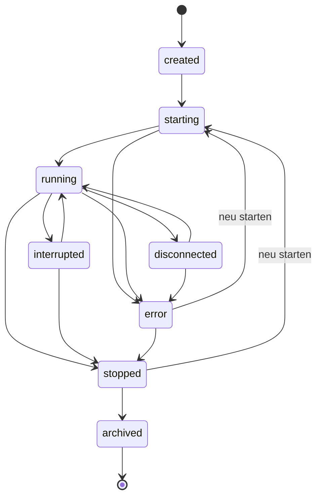

# Domänenmodell und Persistenz

## Modellierungsgrundsatz

Die logische Session ist dauerhaft und stabil. Runtime-Prozesse,
Telegram-Nachrichten und Agenteninstanzen können ersetzt oder wiederverbunden
werden, ohne dass sich die Session-ID ändert.

Die logische Session ist kein eigener Agenten-Chat. Ihr aktiver
`RuntimeInstance` verweist auf die echte native CLI-Session. Nachrichten in
SQLite sind Routing-, Anzeige- und Auditkopien; der laufende Agentenkontext
bleibt in der CLI.

Alle internen Primärschlüssel sind zufällige, nicht erratbare IDs. Anzeigenamen
und Aliase sind veränderbar und werden niemals als alleinige technische
Identität verwendet.

## Hauptobjekte

### User

```text
User
  id
  displayName
  status
  createdAt
  updatedAt
```

Ein Benutzer kann mehrere externe Identitäten besitzen.

### TransportIdentity

```text
TransportIdentity
  id
  userId
  transportType
  transportAccountId
  externalUserId
  externalChatId
  verifiedAt
  revokedAt
```

Telegram-User-ID und Chat-ID werden nicht direkt am User gespeichert. Dadurch
bleibt das Modell für WhatsApp und weitere Kanäle offen.

### Node

```text
Node
  id
  name
  platform
  architecture
  roundtableVersion
  status
  lastSeenAt
```

Für den lokalen Einzelknoten wird automatisch ein Node angelegt. Das Objekt
ermöglicht später mehrere Rechner ohne Umbau des Sessionmodells.

### Project

```text
Project
  id
  nodeId
  name
  canonicalRootPath
  repositoryUrl
  defaultAgentType
  defaultModel
  defaultPermissionProfileId
  defaultNotificationMode
  enabled
  createdAt
  updatedAt
```

Erlaubte Unterpfade, Agenten und Umgebungsreferenzen liegen in eigenen
Relationen.

### AgentProfile

```text
AgentProfile
  id
  agentType
  name
  executable
  defaultModel
  additionalArguments
  environmentReferences
  definitionVersion
  enabled
```

Ein Profil beschreibt eine wiederverwendbare Startkonfiguration. Die
tatsächlich gestartete Session speichert zusätzlich einen Snapshot der
relevanten Werte. Das Profil beschreibt eine CLI und keinen API-Client.

### Session

```text
Session
  id
  nodeId
  projectId
  name
  alias
  agentType
  agentProfileId
  model
  workingDirectory
  gitBranch
  gitWorktreePath
  sessionBackend
  externalCliSessionId
  permissionProfileId
  notificationDefault
  lifecycleStatus
  interactionStatus
  createdByUserId
  createdAt
  startedAt
  lastActivityAt
  stoppedAt
  archivedAt
  version
```

`agentType` und `model` gehören zwingend zur Session. Dadurch sind parallele
Claude- und Codex-Sessions natürlich darstellbar.

`externalCliSessionId` ist optional und enthält eine agenteneigene
Resume-Kennung. Sie ergänzt die tmux-Runtime-ID, ersetzt sie aber nicht als
Tunnel.

Lebenszyklus und Interaktionszustand sollten intern getrennt werden. Eine
Session kann beispielsweise einen laufenden Prozess besitzen und gleichzeitig
auf eine Freigabe warten. Für die UI werden beide zu einem kanonischen Status
verdichtet.

### RuntimeInstance

```text
RuntimeInstance
  id
  sessionId
  backendType
  externalRuntimeId
  externalPaneId
  runtimeMarker
  hostProcessId
  expectedExecutable
  expectedWorkingDirectory
  generation
  status
  terminalColumns
  terminalRows
  outputCursor
  startedAt
  lastSeenAt
  exitedAt
  exitCode
  metadata
```

Ein Neustart erzeugt eine neue Runtime-Generation unter derselben Session.
Historische Runtimeinstanzen bleiben für Audit und Logzuordnung erhalten.

In der ersten Implementierung ist `externalRuntimeId` die stabile
tmux-Session-ID und `externalPaneId` die stabile Pane-ID. `runtimeMarker` ist
eine von Roundtable erzeugte UUID, die zusätzlich als tmux User Option an
Session und Pane gespeichert wird. PID, Startbefehl und Arbeitsverzeichnis sind
sekundäre Evidenz und ersetzen diesen Marker nicht. Genau eine aktive
Runtimeinstanz ist das schreibbare Ziel für Messenger-Replies.

### DefaultSession

```text
DefaultSession
  id
  userId
  transportIdentityId
  sessionId
  setAt
  setBy
```

Eindeutigkeitsregel:

```text
UNIQUE(userId, transportIdentityId)
```

Damit gibt es pro Benutzer und Kanal-/Chatkontext höchstens eine
Default-Session.

Existiert beim erfolgreichen Erstellen der ersten Session noch kein Datensatz,
wird er atomar für diese Session angelegt. Weitere Sessionstarts ändern ihn
nicht.

### Subscription

```text
Subscription
  id
  userId
  transportIdentityId
  sessionId
  mode
  createdAt
  updatedAt
```

Modi:

```text
all_stable
questions_only
approvals_only
completion_only
errors_only
muted
```

### Message

Interne kanonische Nachricht:

```text
Message
  id
  sessionId
  direction
  kind
  sourceUserId
  rawContentReference
  renderedContent
  contentHash
  replyToInternalMessageId
  createdAt
```

Richtungen:

- `agent_to_user`,
- `user_to_agent`,
- `system_to_user`,
- `system_to_session`.

Arten:

- Text,
- Frage,
- Freigabe,
- Fortschritt,
- Abschluss,
- Fehler,
- Datei,
- CLI-Snapshot,
- Systemereignis.

Diese Nachrichten bilden nicht den maßgeblichen Agenten-Thread. Jede
`user_to_agent`-Nachricht muss zusätzlich als `SessionInput` in die native CLI
geschrieben werden; jede `agent_to_user`-Nachricht muss auf erfasste
CLI-Ausgabe zurückführbar sein.

### TransportMessage

```text
TransportMessage
  id
  internalMessageId
  sessionId
  transportType
  transportAccountId
  externalChatId
  externalMessageId
  externalReplyToMessageId
  partIndex
  partCount
  deliveryStatus
  deliveredAt
  editedAt
```

Wichtige Eindeutigkeitsregel:

```text
UNIQUE(transportType, transportAccountId, externalChatId, externalMessageId)
```

Jeder Teil einer gesplitteten Agentenantwort wird derselben Session zugeordnet
und ist routbar.

### InboundTransportUpdate

```text
InboundTransportUpdate
  id
  transportType
  transportAccountId
  externalUpdateId
  payloadHash
  receivedAt
  processedAt
  processingStatus
  error
```

Eindeutigkeitsregel:

```text
UNIQUE(transportType, transportAccountId, externalUpdateId)
```

Sie verhindert doppelte Verarbeitung nach Webhook- oder Polling-Retries.

### SessionInput

```text
SessionInput
  id
  sessionId
  runtimeInstanceId
  sourceMessageId
  sourceUserId
  inputType
  textPayload
  keyPayload
  appendEnter
  interactionId
  idempotencyKey
  sequence
  status
  queuedAt
  preflightPassedAt
  writeStartedAt
  writtenAt
  keySentAt
  deliveredAt
  uncertainAt
  failedAt
  error
```

Der `sequence`-Wert ist innerhalb einer Session monoton. Die Queue verarbeitet
immer die kleinste noch offene Sequenz.

Zulässige Hauptzustände:

- `queued`,
- `preflight_passed`,
- `write_started`,
- `text_written`,
- `key_sent`,
- `delivered`,
- `delivery_uncertain`,
- `failed`,
- `cancelled`.

`delivered` bedeutet nur, dass der technische tmux-Schreibablauf ohne
bekannten Fehler abgeschlossen wurde. Es beweist nicht, dass der Agent den Text
semantisch verarbeitet hat. `delivery_uncertain` ist ein terminaler
Sicherheitszustand für einen Absturz oder Verbindungsverlust nach Beginn des
Schreibens; Roundtable wiederholt ihn nicht automatisch.

### Interaction

```text
Interaction
  id
  sessionId
  runtimeInstanceId
  sourceMessageId
  type
  originalPromptReference
  promptFingerprint
  status
  detectedAt
  expiresAt
  resolvedAt
  resolvedByUserId
  selectedOptionId
```

Status:

- `open`,
- `resolving`,
- `resolved`,
- `expired`,
- `superseded`,
- `failed`.

### InteractionOption

```text
InteractionOption
  id
  interactionId
  label
  inputType
  textPayload
  keyPayload
  appendEnter
  riskClass
  displayOrder
```

Roundtable speichert nicht nur „allow“, sondern die konkrete Terminalwirkung.

### RawOutputSegment

```text
RawOutputSegment
  id
  sessionId
  runtimeInstanceId
  sequenceStart
  sequenceEnd
  storagePath
  byteOffset
  byteLength
  sha256
  capturedAt
```

Große Rohdaten liegen bevorzugt in append-only Dateien. Die Datenbank verwaltet
Index, Cursor und Integrität.

RawOutputSegments stammen immer vom aktiven Session Backend, zunächst
`tmux pipe-pane`. Optionale Hooks dürfen Ereignisse referenzieren, erzeugen aber
keine alternativen Agentennachrichten.

### SessionEvent

```text
SessionEvent
  id
  sessionId
  runtimeInstanceId
  eventType
  payload
  actorType
  actorId
  occurredAt
```

`SessionEvent` ist der nachvollziehbare Verlauf wichtiger Zustandsänderungen,
nicht zwingend ein vollständiges Event-Sourcing-System.

### AuditEntry

```text
AuditEntry
  id
  userId
  sessionId
  action
  targetType
  targetId
  result
  metadata
  occurredAt
```

Freigaben, Default-Wechsel, Start/Stop und sicherheitsrelevante Änderungen
werden als AuditEntry gespeichert.

### OutboxEntry

```text
OutboxEntry
  id
  eventType
  aggregateType
  aggregateId
  payload
  createdAt
  availableAt
  attempts
  processedAt
  lastError
```

Die Outbox sorgt für robuste asynchrone Verarbeitung.

## Sessionzustände

### Lebenszyklus



### Interaktionszustand

```text
unknown
ready
working
waiting_for_input
waiting_for_approval
```

Ein Output-Erkenner oder eine Agenten-Definition darf den Zustand nur mit
Evidenz und Zeitstempel setzen. Veraltete Evidenz wird auf `unknown`
zurückgestuft.

Der Abschluss eines Agententurns ist ein `SessionEvent`, kein Ende des
Sessionlebenszyklus. Bleibt die CLI aktiv, wird der aktuelle
Interaktionszustand anschließend wieder `ready`.

## Invarianten

1. Eine Session hat exakt einen Agententyp.
2. Agententyp und Modell ändern sich nicht still während einer laufenden
   Runtime-Generation.
3. Eine Reply-Zuordnung verweist auf höchstens eine Session.
4. Eine externe eingehende Nachricht wird höchstens einmal als SessionInput
   angelegt.
5. Eine Interaction wird höchstens einmal erfolgreich aufgelöst.
6. SessionInputs werden pro Session in Reihenfolge geschrieben.
7. Eine Default-Zuweisung gilt nur für ihren Benutzer und Transportkontext.
8. Eine fehlende Zielsession erzeugt niemals einen automatischen Fallback auf
   eine fremde Session.
9. Eine Session kann mehrere historische Runtimeinstanzen, aber höchstens eine
   schreibbare aktive Runtimeinstanz besitzen.
10. Gelöschte Transportnachrichten löschen nicht automatisch den lokalen
    Auditverlauf.
11. Ein gestoppter oder archivierter Runtimekontext nimmt keine neue Eingabe an,
    bevor der Benutzer Fortsetzen oder Neustart bestätigt.
12. Projekt- und Benutzerautorisierung wird bei jeder Aktion geprüft, nicht nur
    beim Session-Start.
13. Eine Messenger-Eingabe erreicht den Agenten ausschließlich über die aktive
    native CLI-Session.
14. Eine Agentennachricht besitzt eine Herkunft im erfassten CLI-Output.
15. Die erste erfolgreich erstellte Session wird Default, wenn noch kein
    Default existiert; spätere Sessions ändern den Default nicht.
16. Ein lokales Attach erzeugt keine zweite Session und keinen zweiten
    Agentenkontext.
17. Solange ein normaler interaktiver Client attached ist, beginnt Roundtable
    standardmäßig keinen neuen Pane-Schreibvorgang.
18. Ein SessionInput im Zustand `delivery_uncertain` wird nur nach einer
    ausdrücklichen Benutzeraktion erneut gesendet oder abgeschlossen.
19. Eine Runtime wird nach Neustart nur dann automatisch wiederverbunden, wenn
    gespeicherte tmux-IDs und Roundtable-Marker übereinstimmen.

## Persistenztransaktionen

Folgende Vorgänge müssen atomar sein:

### Eingehende Nachricht

- Transportupdate als gesehen markieren,
- Zielsession auflösen,
- kanonische Nachricht speichern,
- SessionInput anlegen,
- Outbox-Eintrag für Queue-Verarbeitung erzeugen.

Das Erstellen des `SessionInput` ist idempotent. Das spätere Schreiben in ein
PTY kann nach einem Prozessabbruch jedoch nicht in allen Fällen genau einmal
bewiesen werden. Persistenz verhindert deshalb automatische Doppelzustellung,
indem ein unklarer Schreibzustand sichtbar stehen bleibt.

### Ausgehende Nachricht

Telegram-Zustellung selbst kann nicht Teil einer SQLite-Transaktion sein.
Deshalb:

1. Outbound-Vorhaben und Outbox speichern.
2. Nachricht senden.
3. externe Nachrichten-ID und Sessionmapping speichern.
4. bei Schritt 3 Fehler sichtbar behandeln und Wiederholung deduplizieren.

### Freigabe

- offene Interaction und erwartete Version prüfen,
- Status atomar von `open` auf `resolving` setzen,
- SessionInput mit Idempotenzschlüssel anlegen,
- nach Runtime-Schreiben auf `resolved` setzen,
- vor Schreibbeginn bei Fehler kontrolliert auf `open` oder `failed`
  zurücksetzen,
- nach unklarem Schreibbeginn Interaction und SessionInput als unklar markieren
  und keine zweite Eingabe erzeugen.

### Default-Wechsel

- Zugriff auf neue Session prüfen,
- vorhandene Zuweisung ersetzen,
- AuditEntry schreiben.

## Aufbewahrung

Konfigurierbare Kategorien:

- Routingmetadaten: lange Aufbewahrung, da klein und wichtig,
- Auditdaten: nach Sicherheitsprofil,
- gerenderte Nachrichten: konfigurierbar,
- Raw Output: Größen- oder Zeitlimit,
- Dateien und Screenshots: kurze Standardaufbewahrung,
- archivierte Sessions: Metadaten erhalten, große Logs optional bereinigen.

Bereinigung darf keine noch benötigten Reply-Zuordnungen unbemerkt zerstören.
Wenn eine Zuordnung bewusst abläuft, muss eine spätere Reply sicher abgelehnt
und neu zugeordnet werden können.

## Migrationen und Backups

- Jede Version bringt nummerierte Schema-Migrationen mit.
- Vor riskanten Migrationen wird eine lokale Sicherung angeboten oder erzeugt.
- SQLite wird über eine konsistente Backup-Methode gesichert, nicht durch
  blindes Kopieren einer aktiven WAL-Datenbank.
- Roh-Logs und Datenbankbackup besitzen ein gemeinsames Manifest.
- Downgrades werden nur unterstützt, wenn eine explizite Rückmigration
  vorhanden ist.
