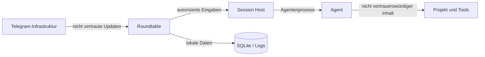

# Sicherheit und Betrieb

## Sicherheitsziel

Roundtable verbindet einen internetbasierten Messaging-Kanal mit lokalen
Terminalprozessen, die Quellcode lesen, Dateien ändern und Befehle ausführen
können. Der Router ist deshalb eine sicherheitskritische Fernsteuerung.

Das Ziel ist nicht, alle Risiken eines Agenten zu beseitigen. Roundtable muss
aber verhindern, dass:

- nicht autorisierte Personen Sessions sehen oder bedienen,
- Nachrichten an falsche Sessions gelangen,
- Projekte außerhalb freigegebener Pfade gestartet werden,
- Secrets unnötig über Telegram oder Logs ausgegeben werden,
- alte Buttons erneut riskante Aktionen auslösen,
- ein kompromittierter Adapter den gesamten Host unbeschränkt kontrolliert,
- Sicherheitsprofile nur kosmetische UI-Einstellungen sind.

## Bedrohungsmodell

### Angreifer mit Kenntnis des Bot-Namens

Ein fremder Telegram-Benutzer schreibt dem Bot. Gegenmaßnahme:

- deny by default,
- Allowlist nach unveränderlicher Telegram-User-ID,
- sicheres Pairing,
- keine preisgegebenen Projekt- oder Sessionnamen vor Autorisierung,
- Rate Limits und Audit.

### Gestohlener Bot-Token

Ein Angreifer kann Botupdates lesen oder senden. Gegenmaßnahme:

- Token im Betriebssystem-Secret-Store oder restriktiver Secretdatei,
- Token niemals in Repository, Datenbankexport oder Log,
- einfache Rotation,
- optional Webhook-Secret oder abgesicherte Polling-Instanz,
- Benutzerautorisierung bleibt zusätzlich erforderlich.

Ein gestohlener Token ist dennoch kritisch und muss wie ein
Fernzugriffsschlüssel behandelt werden.

### Gestohlenes oder entsperrtes Mobiltelefon

Ein Angreifer verfügt über den autorisierten Telegram-Account. Gegenmaßnahme:

- optionaler Roundtable-PIN oder erneute lokale Bestätigung für kritische
  Aktionen,
- zeitlich begrenzte Freigabebuttons,
- risikobasierte Bestätigung,
- Session und Projekt in jedem kritischen Dialog,
- sofortige Identitätswiderrufung über lokale CLI.

### Manipulierte Reply oder veralteter Button

Ein Benutzer antwortet auf eine alte Nachricht oder klickt nach lokaler
Interaktion einen überholten Button. Gegenmaßnahme:

- serverseitiges Message-Mapping,
- Interaction-ID und Status,
- Prompt-Fingerprint und Runtime-Generation,
- atomarer Zustandswechsel,
- keine clientseitig vertrauten Sessiondaten,
- aktuelle Screen-Prüfung vor Tastenfolge.

### Prompt Injection durch Projektinhalt

Ein Agent liest manipulierte Dateien und schlägt riskante Aktionen vor.
Roundtable kann den Agenteninhalt nicht als vertrauenswürdig behandeln.
Gegenmaßnahme:

- Roundtable-Berechtigungsprofile unabhängig vom Agenten,
- kritische Aktionen nicht allein aufgrund eines Agententexts freigeben,
- originale Aktion und Zielkontext anzeigen,
- Produktions- und Secretzugriffe standardmäßig ausschließen,
- optional OS-Sandbox oder Container.

### Schädlicher oder fehlerhafter Agent-Adapter

Ein Adapter baut einen unsicheren Shellstring oder erkennt eine Freigabe falsch.
Gegenmaßnahme:

- strukturierte Prozessargumente,
- keine Shell als Standard,
- kleine, prüfbare Adapteroberfläche,
- Capability Detection,
- Tests mit aufgezeichneten Terminaltranskripten,
- sichere Fallbacks ohne Approval-Buttons,
- später isolierbare externe Plugins.

### Pfadflucht

Ein Projektpfad enthält `..`, Symlinks oder plattformspezifische Alias-Pfade.
Gegenmaßnahme:

- kanonische Pfadauflösung,
- Prüfung nach Auflösung,
- Allowlist auf kanonischen Roots,
- erneute Prüfung vor Start und Worktree-Erstellung,
- Windows Junctions und WSL-Pfade gesondert behandeln.

### Lokaler Benutzer

Ein anderer lokaler Benutzer liest Datenbank, Logs oder Sessionpipes.
Gegenmaßnahme:

- restriktive Dateirechte,
- benutzerspezifischer Dienst,
- lokale Sockets/Pipes mit ACL,
- kein privilegierter Systemdienst ohne Notwendigkeit,
- Secrets getrennt von normalen Logs.

## Vertrauensgrenzen



- Telegram transportiert Nachrichten, entscheidet aber keine Autorisierung.
- Agentenausgabe ist Inhalt, keine vertrauenswürdige Steueranweisung für den
  Roundtable Core.
- Projektdateien können bösartige Instruktionen enthalten.
- Session Hosts akzeptieren nur authentifizierte lokale Roundtable-Verbindungen.

## Authentifizierung und Pairing

Vorgeschlagener Erstablauf:

1. Benutzer startet `roundtable setup`.
2. Bot-Token wird sicher gespeichert.
3. CLI erzeugt einen kurzlebigen Einmalcode.
4. Benutzer sendet `/pair <code>` im privaten Bot-Chat.
5. Roundtable zeigt lokale und Telegram-Identität an.
6. Pairing wird lokal oder über einen zweiten Faktor bestätigt.
7. Telegram-User-ID und Chat-ID werden freigeschaltet.
8. Einmalcode wird unwiderruflich verbraucht.

Pairing-Codes:

- ausreichend zufällig,
- kurze Ablaufzeit,
- höchstens einmal verwendbar,
- gehasht gespeichert,
- nach Fehlversuchen limitiert.

## Autorisierung

Jede Aktion prüft:

- Transportidentität ist aktiv,
- Benutzer darf die Session sehen,
- Session gehört zu einem erlaubten Node,
- Projekt ist aktiviert,
- Pfad liegt weiterhin in der Allowlist,
- Aktion ist im Berechtigungsprofil zulässig,
- Interaction oder Message Mapping ist gültig,
- Runtime-Generation ist aktuell.

Autorisierung findet im Core statt. Transportbuttons sind keine
Sicherheitsgrenze.

## Berechtigungsprofile

### Nur lesen

Ziel:

- Projektanalyse ohne beabsichtigte Änderungen.

Regeln:

- Agent in seinem restriktivsten sinnvollen Modus starten,
- schreibende Roundtable-Aktionen blockieren,
- Worktree-Erstellung nur als vorbereitende Benutzeraktion,
- Shell- und Toolfreigaben nach Policy einschränken.

Ein Agent kann möglicherweise trotz Prompt versehentlich schreiben. Für starke
Garantien ist eine OS- oder Container-Sandbox nötig.

### Standard

Ziel:

- normale Entwicklungsarbeit im freigegebenen Projekt.

Regeln:

- Dateiänderungen im Projekt erlaubt,
- normale Tests und lokale Builds möglich,
- riskante Git-, Netzwerk-, Paket-, Datenbank- und Serviceaktionen verlangen
  Freigabe,
- Zugriffe außerhalb des Projekts blockiert oder bestätigt.

### Vertrauenswürdig

Ziel:

- weniger Rückfragen innerhalb eines eng definierten Projekts.

Regeln:

- nur für explizit ausgewählte Projekte,
- erlaubte Aktionsklassen werden einzeln konfiguriert,
- Produktionsaktionen bleiben standardmäßig ausgeschlossen,
- vollständiges Audit bleibt aktiv.

### Eingeschränkt

Ziel:

- maximale Benutzerkontrolle.

Regeln:

- relevante Agentenaktionen benötigen Bestätigung,
- keine dauerhafte Freigabe ohne gesonderte Policyänderung,
- kurze Interaction-Ablaufzeiten.

## Approvals

Roundtable behandelt Approvals als Terminalinteraktionen:

- Originalprompt anzeigen,
- Optionen und konkrete Tastenwirkung speichern,
- Antwort genau einmal senden,
- keine semantische Umdeutung,
- keine automatische Zustimmung im Standard,
- veralteten Terminalzustand erkennen.

„Für diese Session erlauben“ darf nur angeboten werden, wenn entweder der Agent
diese Option selbst anbietet oder Roundtable eine ausdrücklich dokumentierte
Policyänderung vornimmt. Eine einzelne Taste darf nicht irreführend als
dauerhafte Roundtable-Regel bezeichnet werden.

## Secret-Schutz

### Speicherung

Bevorzugte Speicher:

- Linux: Secret Service, systemd credentials oder restriktive Datei als
  Fallback,
- macOS: Keychain,
- Windows: Credential Manager oder DPAPI-geschützter Store.

### Übertragung

Vor Telegram-Ausgabe kann ein deterministischer Filter bekannte Secretwerte und
Muster maskieren:

- konfigurierte API-Schlüssel,
- Bot-Token,
- private Schlüssel,
- bekannte Passwortvariablen,
- Connection Strings.

Der Filter ist eine zusätzliche Schutzschicht und keine Garantie. Standardmäßig
soll Roundtable Warnungen ermöglichen, wenn Agenten große Environment-Dumps
oder bekannte Secretdateien ausgeben.

### Logs

- keine vollständigen Umgebungsvariablen,
- keine unmaskierten Startbefehle mit Secrets,
- Telegram-Updatepayloads nur bei explizitem Debugmodus und redigiert,
- Raw Output erhält eigene restriktive Rechte und Retention,
- Fehlerberichte trennen Diagnosemetadaten von Inhalten.

## Netzwerk

- Lokale API standardmäßig nur über Unix Socket, Named Pipe oder Loopback.
- Keine unauthentifizierte öffentliche Weboberfläche.
- Telegram-Verbindung ausschließlich verschlüsselt.
- Optionale Webhooks benötigen Secret und sichere TLS-Terminierung.
- Agentennetzwerkzugriff wird vom Agenten-/Sandboxprofil kontrolliert, nicht
  automatisch durch Telegram-Freigaben erweitert.
- Remote Nodes benötigen gegenseitige Authentifizierung und Rotation.

## Dateisystem und Prozessrechte

Roundtable soll als normaler Benutzer laufen, nicht als `root` oder
Administrator. Projekte, Agenten und Session Hosts verwenden dessen Rechte oder
noch restriktivere Identitäten.

Empfehlungen:

- eigenes Datenverzeichnis mit Benutzerzugriff,
- Session-Host-Sockets nur für den Besitzer,
- keine Shell-Interpolation für Telegramtexte,
- keine dynamischen ausführbaren Pfade außerhalb freigegebener Profile,
- Arbeitsverzeichnis vor jedem Start kanonisch prüfen,
- temporäre Dateien sicher und mit restriktiven Rechten anlegen.

## Installation

### Gemeinsames Ziel

Für jede Plattform soll es einen nachvollziehbaren Installationsweg geben:

```text
roundtable install
roundtable setup
roundtable doctor
roundtable start
```

### Linux

- Paket oder einzelnes Binary,
- optionales Repository für Updates,
- `systemd --user` Dienst,
- tmux-Abhängigkeit prüfen oder installieren,
- Daten unter plattformüblichem Benutzerdatenpfad.

### macOS

- signiertes/notarisiertes Binary oder Homebrew-Paket,
- `launchd` User Agent,
- tmux-Abhängigkeit oder eigener Session Host,
- Keychain für Secrets.

### Windows

- signierter Installer oder Paketmanager,
- Roundtable Core plus Session Host,
- Benutzer-Dienst oder klarer Autostartmodus,
- ConPTY-Verfügbarkeit prüfen,
- Credential Manager/DPAPI,
- optionaler WSL-Modus.

### Container

Docker kann für VPS-Nutzer angeboten werden, ist aber nicht der einzige
Installationsweg. Interaktive PTYs, Projekt-Mounts, SSH-Schlüssel und
Docker-outside-of-Docker müssen ausdrücklich dokumentiert und begrenzt werden.

## Diagnose

`roundtable doctor` prüft ohne riskante Änderungen:

- Datenverzeichnis und Rechte,
- Datenbankintegrität,
- Telegram-Konfiguration und Erreichbarkeit,
- autorisierte Identitäten,
- installierte Agenten und Versionen,
- verfügbare Runtime-Backends,
- tmux oder ConPTY,
- Projektpfade,
- Git,
- lokale Socket-/Pipe-Kommunikation,
- ausstehende Migrationen,
- Speicherplatz,
- verwaiste Session Hosts.

Secretwerte werden nie ausgegeben.

## Logs und Beobachtbarkeit

Strukturierte Logs enthalten:

- Zeit,
- Schweregrad,
- Komponente,
- Session-ID,
- Runtime-ID,
- Eventtyp,
- Ergebnis,
- redigierte Fehlermetadaten.

Metriken:

- laufende Sessions,
- offene Interaktionen,
- Queue-Länge,
- Zustelllatenz,
- Telegram-Fehler,
- Runtime-Wiederverbindungen,
- Output-Backlog,
- Datenbankgröße,
- Raw-Log-Größe.

Ein lokaler Statusbefehl zeigt die wichtigsten Werte. Externe
Monitoring-Integration folgt später.

## Backups und Wiederherstellung

Gesichert werden:

- SQLite-Datenbank,
- Konfiguration,
- verschlüsselte oder referenzierte Secrets nach Plattformverfahren,
- optional Raw Logs und Artefakte,
- Manifest mit Version und Prüfsummen.

Nicht blind gesichert werden:

- lebende PTY-Handles,
- temporäre Sockets,
- Prozess-IDs als wiederherstellbarer Zustand.

Nach Restore werden Runtimeinstanzen als nicht bestätigt behandelt und
vorsichtig neu entdeckt.

## Updates

- laufende Sessions vor Update anzeigen,
- Session Hosts möglichst kompatibel weiterlaufen lassen,
- Datenbanksicherung vor Migration,
- versioniertes lokales Protokoll zwischen Core und Session Host,
- inkompatible Session Hosts kontrolliert aktualisieren,
- fehlgeschlagene Migration stoppt den neuen Core ohne Datenverlust,
- keine automatische Löschung alter Logs oder Worktrees.

## Ausfälle

### Telegram nicht erreichbar

Sessions laufen weiter. Ausgehende Nachrichten bleiben in der Outbox und werden
mit Begrenzung erneut versucht. Bei großem Rückstau wird zusammenhängender
Inhalt als Datei oder lokaler Verlauf angeboten, ohne ihn semantisch zu
verändern.

### Core stürzt ab

tmux oder separate Session Hosts halten Agenten weiter. Nach Neustart werden
Runtimes und Output-Cursor wiederverbunden.

### Session Host stürzt ab

Session wird als `disconnected` oder `error` markiert. Agent-Resume oder
Runtime-Neustart wird angeboten.

### Datenbank nicht schreibbar

Neue Eingaben und Approvals werden blockiert, weil Idempotenz und Audit nicht
garantiert werden können. Laufende Agenten dürfen weiterlaufen, aber der
Benutzer erhält eine klare lokale und transportseitige Warnung.

### Speicher voll

Raw-Output-Erfassung wird kontrolliert pausiert, keine Logs werden unkontrolliert
überschrieben. Neue Sessions können blockiert werden. Kritische Statusmeldungen
verwenden einen reservierten oder minimalen Pfad.

## Datenschutz

- Lokale Speicherung ist der Standard.
- Telegram erhält nur Inhalte, die der Benutzer abonniert oder explizit
  anfordert.
- Raw Logs können deaktiviert oder kurz aufbewahrt werden, soweit dies
  Wiederverbindung und Audit nicht verletzt.
- Exporte sind explizite Benutzeraktionen.
- Mehrbenutzersysteme benötigen Trennung von Sessionverläufen und Projekten.
